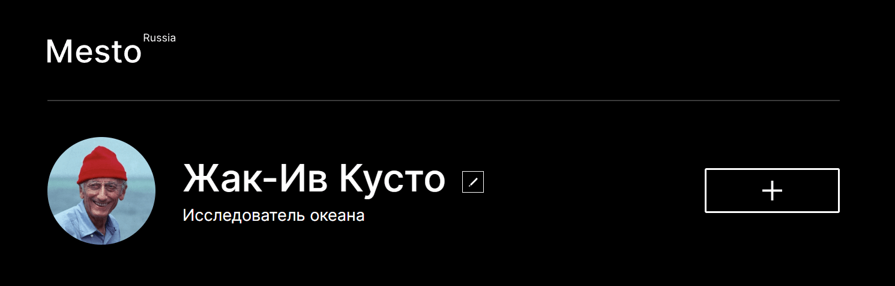

# Проект: Место.

*Проектная работа на курсе по веб-разработке от [Яндекс-практикума](https://practicum.yandex.ru/ "Перейти на сайт практикума")*

## Обзор

Проект интерактивного сервиса о путешествиях по России, выполненный на основе [макета](https://www.figma.com/file/2cn9N9jSkmxD84oJik7xL7/JavaScript.-Sprint-4?node-id=0%3A1 "Посмотреть макет") в Figma. 

Для реализации проекта были использованы: библиотека React, технологии Grid Layout, flexbox, а также применены медиазапросы.

## Стек технологий

* HTML
* CSS
* JavaScript
* React
* MongoDB
* Express

Данные пользователя загружаются с сервера:

Карточки мест также отрисовываются после получения ответа от сервера:

Изображение из карточки можно увеличить, кликнув по нему:

Реализовано плавное открытие и закрытие попапов. Любой попап можно закрыть кликнув на крестик.

## Последние обновления

На сайте теперь можно зарегистрироваться и авторизоваться:

Если при регистрации произошла ошибка, пользователь увидит всплывающее окно с информацией:

Пользователь может создавать свои карточки мест и удалять их. 
Также можно ставить "лайки" карточкам и убирать их, если мнение изменилось.

## __Связаться со мной__
sashakostiukova@yandex.ru

